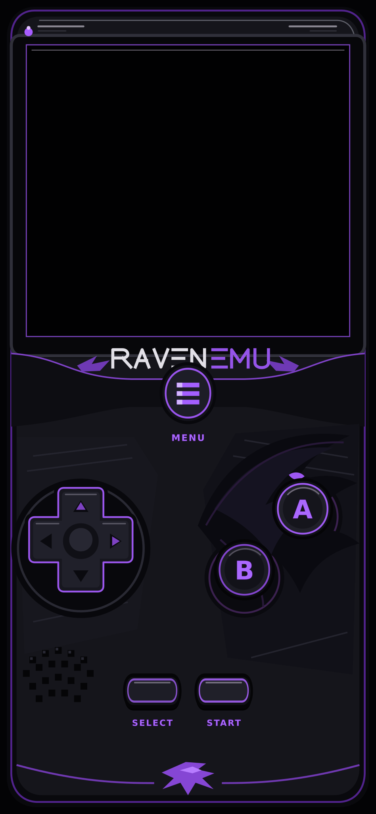
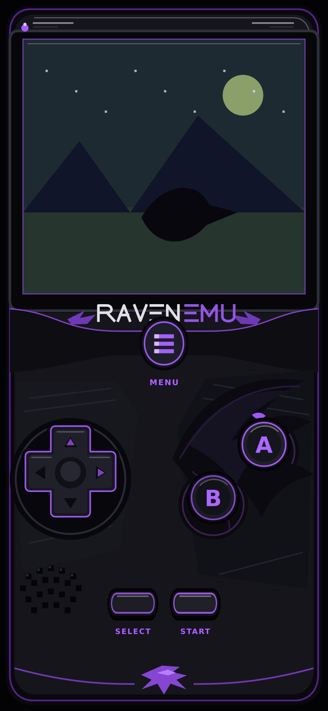
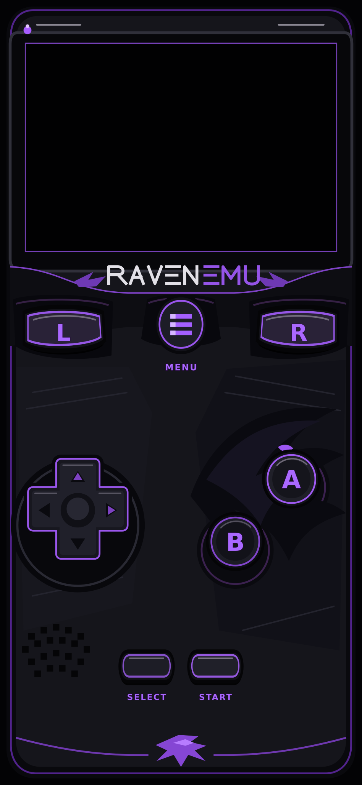
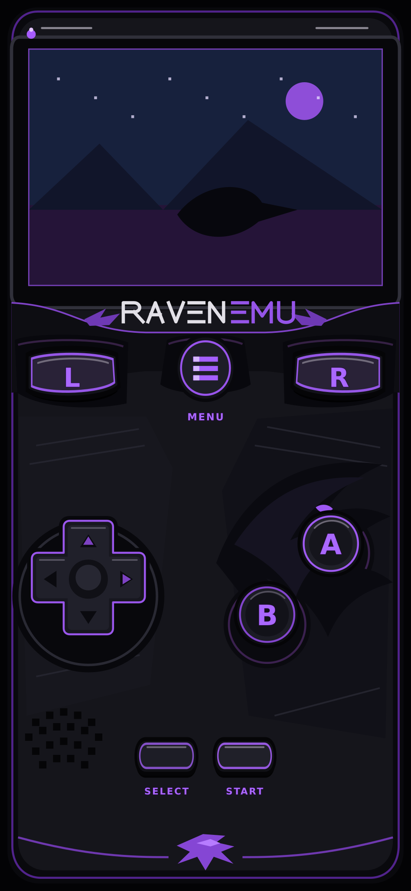
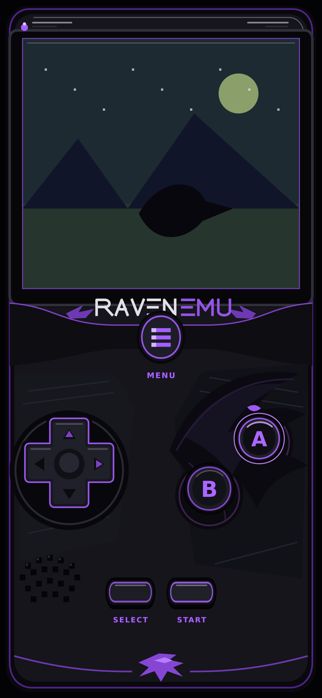
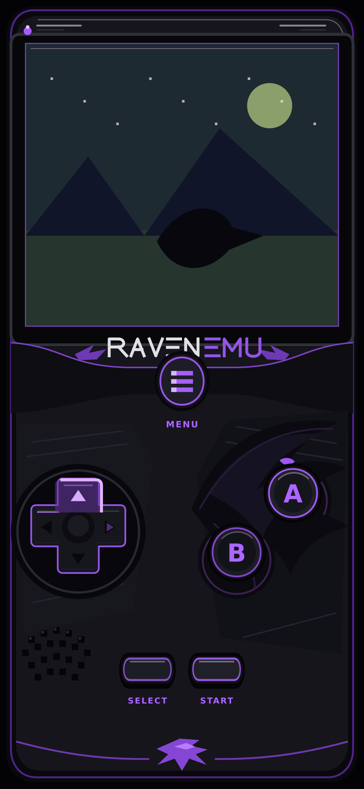
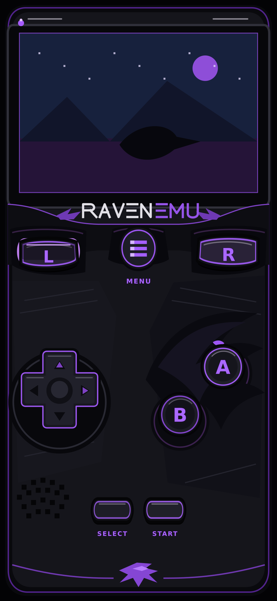

# Previews des skins RavenEmu

Ces previews sont rendues à partir des mêmes `VectorDrawable` que
l’application. Les écrans « avec jeu » utilisent une scène synthétique
originale, uniquement destinée à vérifier le cadrage natif.

| État | Preview |
| --- | --- |
| GB/GBC sans jeu |  |
| GB/GBC avec jeu |  |
| GBA sans jeu |  |
| GBA avec jeu |  |
| Bouton A pressé |  |
| Direction haute pressée |  |
| Gâchette L pressée |  |

Pour régénérer les images :

```shell
python3 tools/render_raven_skin_previews.py
```
